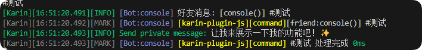

# 消息插件开发完全指南

本文将详细介绍 Karin 框架中消息插件的开发方法，帮助开发者掌握从简单到复杂的各类插件实现技巧。

## 基本示例

首先通过一系列简单示例来了解 Karin 插件的基本用法：

```js
import { karin, segment } from 'node-karin'

// 基础交互式回复
export const hello = karin.command('^(#)?你好$', async (e) => {
  await e.reply('你好啊！我是Karin，很高兴见到你~ (。・∀・)ノ', { at: false, recallMsg: 0, reply: true })
  return true
})

// 最简单的静态回复
export const test = karin.command('^(#)?测试$', '让我来展示一下我的功能吧！✨')

// 单个消息段回复
export const text = karin.command('^(#)?打招呼$', segment.text('大家好呀！今天也要元气满满哦！╰(*°▽°*)╯'), { name: '打招呼' })

// 混合消息段回复
export const mix = karin.command('^(#)?混合$', [
  '大家好呀！今天也要元气满满哦！╰(*°▽°*)╯',
  segment.image('https://img.example.com/vant/ipad.png'),
], { name: '混合消息示例' })

// 带完整配置的函数式回调
export const menuCommand = karin.command('^(#)?菜单$', async (e) => {
  await e.reply('来看看我都会些什么吧~\n- #你好：打个招呼\n- #测试：功能展示\n- #打招呼：元气问候\n(｡･ω･｡)ﾉ♡')
  }, {
    event: 'message',    // 监听的事件类型
    name: '功能菜单',     // 插件名称
    perm: 'all',        // 触发权限设置
    at: false,          // 是否需要@机器人（群聊中）
    reply: false,       // 是否以引用形式回复
    recallMsg: 0,       // 消息自动撤回时间（秒）
    log: true,          // 是否记录日志
    rank: 10000,        // 优先级排序
    adapter: [],        // 适用的适配器列表
    dsbAdapter: [],     // 禁用的适配器列表
    delay: 0,           // 延迟回复时间（毫秒）
    stop: false,        // 是否阻止后续插件执行
    authFailMsg: '抱歉，您没有权限使用此功能 (๑•́ㅿ•̀๑)՞',
})
```

## command 函数详解

`karin.command` 是创建消息插件的核心函数，它提供了灵活且强大的消息处理能力。

### 参数说明

`karin.command` 接收3个参数：

1. **匹配规则**：正则表达式或字符串格式的正则，用于匹配用户消息
2. **响应内容**：支持多种形式
   - 文本字符串：直接回复该文本
   - 消息段对象：回复单个消息段
   - 消息段数组：回复复合消息
   - 回调函数：执行自定义逻辑
3. **配置选项**：可选，用于设置插件行为

在开发环境（`pnpm dev`）下，可以通过控制台直接输入指令来测试插件功能。

## 文本回复示例

最简单的插件形式是文本回复，如下图所示：



当用户发送 `#测试` 时，插件会自动回复 `让我来展示一下我的功能吧！✨`。

## 消息段详解

消息段（Message Segment）是构建丰富交互的基础，它允许机器人发送文本以外的多媒体内容。

### 什么是消息段？

消息段是一种结构化的消息单元，可以表示文本、图片、表情、@用户等多种消息元素。Karin 框架通过 `segment` 对象提供了丰富的消息段构造方法。

### 图片消息段示例

```js
// 使用网络图片
export const netImage = karin.command('^(#)?网络图片$', segment.image('https://img.example.com/vant/ipad.png'))

// 使用本地图片
export const localImage = karin.command('^(#)?本地图片$', segment.image('file:///root/img/vant/ipad.png'))

// 使用Base64图片
export const base64Image = karin.command('^(#)?Base64图片$', segment.image('base64://iVBORw0KGgoAAAANSUhEUgAAAAEAAAABCAYAAAAfFcSJAAAADUlEQVR42mP8/x+AAx4BoVgm+QAAAABJRU5ErkJggg=='))
```

### 资源协议支持

Karin 支持三种资源协议：

- `http(s)://` - 网络资源
- `file://` - 本地文件（需使用绝对路径）
- `base64://` - Base64 编码数据

### 组合式消息

复杂交互往往需要组合多种消息段，Karin 支持通过数组形式组合不同消息段：

```js
export const combined = karin.command('^(#)?组合消息$', [
  segment.text('这是一段文字说明'),
  segment.image('https://img.example.com/vant/ipad.png'),
  segment.at(123456789),  // @特定用户
  '\n请查看以上内容'      // 纯文本也可以直接在数组中使用
])
```

更多消息段类型请参考 [segment 文档](../api/utils/message.md#消息段构造函数)。

## 函数回调高级用法

对于需要复杂逻辑处理的场景，可以使用回调函数方式：

```js
export const complexCommand = karin.command('^(#)?查询(.+)$', async (ctx, next) => {
  // 从正则匹配中提取参数
  const keyword = ctx.matched[2]
  
  // 执行业务逻辑
  const result = await someService.query(keyword)
  
  // 根据结果构造回复
  await ctx.reply(`查询结果：${result || '未找到相关信息'}`)
  
  // 允许消息继续传递给其他插件
  next()
})
```

其中:

- `ctx` - 上下文对象，包含消息事件的所有信息和实用方法
- `next` - 调用后允许消息继续传递给后续匹配的插件

更多事件上下文信息请参考 [事件文档](../event/index.md)。

## 插件配置详解

所有类型的消息插件都支持以下配置项，全部参数均为可选，但推荐至少配置 `name` 以便于管理。

| 参数          | 类型                      | 说明                                 |
| ------------- | ------------------------- | ------------------------------------ |
| `name`        | `string`                  | 插件名称，用于日志和管理             |
| `log`         | `boolean`                 | 是否记录插件执行日志                 |
| `perm`        | [权限类型](#权限类型)     | 使用权限限制                         |
| `rank`        | `number`                  | 插件执行优先级（数值越小优先级越高） |
| `adapter`     | [适配器列表](#适配器类型) | 允许使用的适配器                     |
| `dsbAdapter`  | [适配器列表](#适配器类型) | 禁用的适配器                         |
| `permission`  | -                         | 同 `perm`，别名                      |
| `priority`    | `number`                  | 同 `rank`，别名                      |
| `event`       | [事件类型](#事件类型)     | 监听的事件类型                       |
| `at`          | `boolean`                 | 是否需要@机器人才触发（仅群聊有效）  |
| `reply`       | `boolean`                 | 回复时是否使用引用形式               |
| `recallMsg`   | `number`                  | 消息发送后自动撤回的时间（秒）       |
| `authFailMsg` | `string`                  | 权限检查失败时的回复消息             |

### 字符串回复特有配置

| 参数        | 类型      | 说明                                       |
| ----------- | --------- | ------------------------------------------ |
| `stop`      | `boolean` | 是否阻止后续插件执行（仅适用于非函数回调） |
| ~~`delay`~~ | `number`  | 延迟回复时间（毫秒）（已弃用）             |

### 权限类型

```ts
/**
 * 权限类型定义
 * - `all`: 所有人可用
 * - `master`: 仅机器人主人可用
 * - `admin`: 管理员可用
 * - `group.owner`: 群主可用
 * - `group.admin`: 群管理员可用
 * - `guild.owner`: 频道所有者可用
 * - `guild.admin`: 频道管理员可用
 */
export type Permission = 
  | 'all' 
  | 'master' 
  | 'admin' 
  | 'group.owner' 
  | 'group.admin' 
  | 'guild.owner' 
  | 'guild.admin'
```

### 适配器类型

```ts
/**
 * 支持的适配器协议
 * - `console`: 控制台
 * - `qqbot`: QQ机器人官方API
 * - `icqq`: ICQQ协议
 * - `gocq-http`: Go-CQHTTP协议
 * - `napcat`: NapCat协议
 * - `oicq`: OICQ协议
 * - `llonebot`: LLOneBot协议
 * - `conwechat`: ComWeChatBot协议
 * - `lagrange`: Lagrange协议
 */
export type AdapterProtocol =
  | 'qqbot'
  | 'icqq'
  | 'gocq-http'
  | 'napcat'
  | 'oicq'
  | 'llonebot'
  | 'conwechat'
  | 'lagrange'
  | 'console'
  | 'other'
```

### 事件类型

- `message` - 所有消息事件
- `message.group` - 群聊消息
- `message.friend` - 好友消息
- `message.guild` - 频道消息
- `message.direct` - 私聊消息
- `message.groupTemp` - 群临时会话消息

## 类式插件开发

除了函数式插件，Karin 还支持通过类继承方式创建结构化的插件，特别适合开发复杂功能。

### 基本示例

```js
import { Plugin, segment } from 'node-karin'

export class HelloPlugin extends Plugin {
  constructor() {
    super({
      name: '问候插件',
      rule: '^(#)?你好$',
      desc: '回复友好的问候',
      event: 'message',
      priority: 5000
    })
  }

  // 类插件必须实现accept方法作为入口
  async accept() {
    await this.reply('你好啊！很高兴认识你~ (。・∀・)ノ')
    return true
  }
}
```

### 类插件配置选项

| 参数       | 类型                  | 说明           |
| ---------- | --------------------- | -------------- |
| `name`     | `string`              | 插件名称       |
| `rule`     | `string \| RegExp`    | 指令匹配规则   |
| `desc`     | `string`              | 插件描述       |
| `event`    | [事件类型](#事件类型) | 监听的事件类型 |
| `priority` | `number`              | 执行优先级     |

### 类插件方法

类插件中可以使用以下关键属性和方法：

- `this.e` - 当前消息事件对象
- `this.reply()` - 快捷回复方法
- `this.next()` - 允许消息继续传递
- `this.replyForward()` - 发送合并转发消息

### 高级类插件示例

```js
import { Plugin, segment } from 'node-karin'

export class MenuPlugin extends Plugin {
  constructor() {
    super({
      name: '高级菜单插件',
      rule: '^(#)?菜单$',
      desc: '展示插件功能列表',
      event: 'message',
      priority: 10000
    })
    
    // 可以定义插件内部状态
    this.menuCache = null
    this.lastUpdateTime = 0
  }

  async accept() {
    // 检查缓存是否需要更新
    if (!this.menuCache || Date.now() - this.lastUpdateTime > 3600000) {
      await this.updateMenuCache()
    }
    
    // 构建菜单内容
    const menu = [
      '=== Karin功能菜单 ===',
      '- #你好：打个招呼',
      '- #测试：功能展示',
      '- #图片：随机图片',
      '- #天气 [城市]：查询天气'
    ].join('\n')
    
    // 发送带图片的菜单
    await this.reply([
      segment.text(menu),
      segment.image('https://example.com/menu.jpg')
    ])
    
    return true
  }
  
  // 插件可以定义其他辅助方法
  async updateMenuCache() {
    // 更新菜单缓存的逻辑
    this.menuCache = await someService.getMenuData()
    this.lastUpdateTime = Date.now()
  }
}
```

类式插件特别适合需要维护内部状态或包含多个关联命令的复杂功能，能更好地组织代码结构，提升可维护性。
