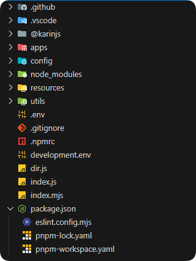
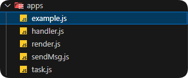

## 了解项目结构

> 本章以 `JavaScript` 为例

可以看到，项目结构如下：

但是此时我们不需要过度关心这些，只需要关心 `apps` 文件夹即可。

### apps

展开 `apps` 文件夹，可以看到如下文件：

- `example.js`: 消息插件基本示例
- `render.js`: 调用渲染器生成图片
- `sendMsg.js`: 主动发送消息、转发消息示例
- `task.js`: 定时任务插件示例
- `handler.js`: 进阶 处理器使用示例